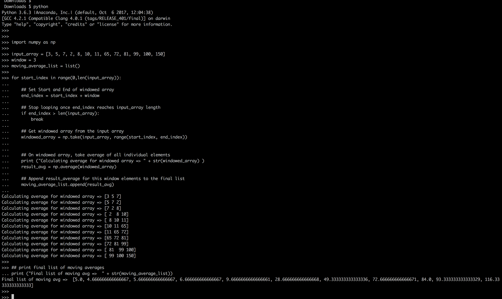
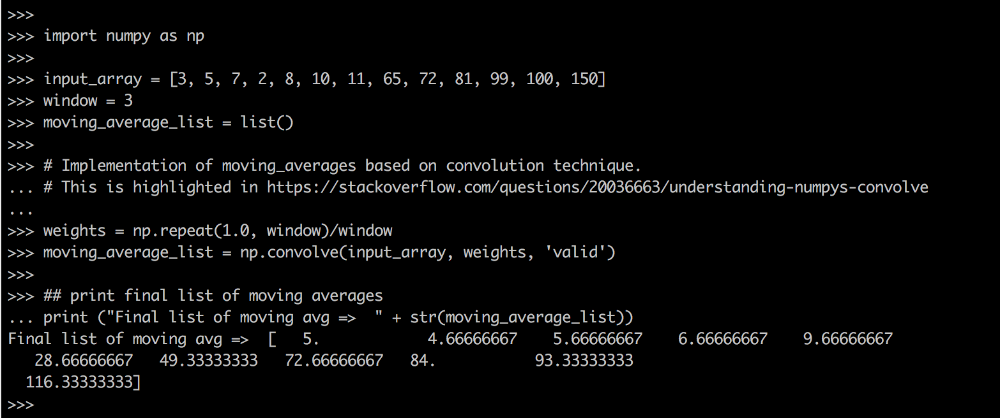

# Problem Statement :
```
Write a function to find moving average in an array over a window:
Test it over [3, 5, 7, 2, 8, 10, 11, 65, 72, 81, 99, 100, 150] and window of 3.
```

## Snapshot - simple numpy array implementation 





## Snapshot - numpy convolution implementation



